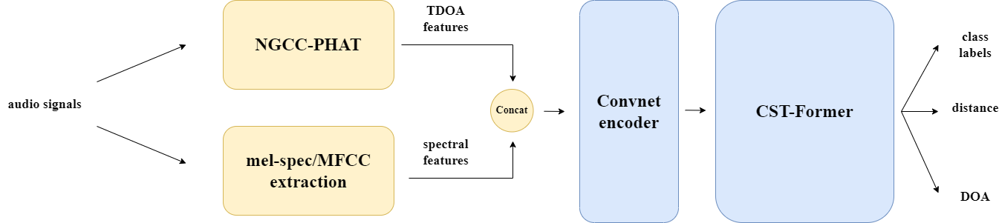

# Sound Event Localization and Detection using Multi-Target TDOA Features



This repository implements the audio-only part of our [DCASE 2024 challenge submission](https://dcase.community/documents/challenge2024/technical_reports/DCASE2024_Berg_24_t3.pdf). 

```
@techreport{Berg_LU_task3_report,
    Author = "Berg, Axel and Engman, Johanna and Gulin, Jens and Astrom, Karl and Oskarsson, Magnus",
    title = "THE LU SYSTEM FOR DCASE 2024 SOUND EVENT LOCALIZATION AND DETECTION CHALLENGE",
    institution = "DCASE2024 Challenge",
    year = "2024",
}
```

This repository is based on the [DCASE 2024 SELD challenge baseline implementation](https://github.com/partha2409/DCASE2024_seld_baseline).


[Please visit the official webpage of the DCASE 2024 Challenge for details missing in this repo](https://dcase.community/challenge2024/task-audio-and-audiovisual-sound-event-localization-and-detection-with-source-distance-estimation).

## Datasets

Download the MIC dataset from here: [**Sony-TAu Realistic Spatial Soundscapes 2023 (STARSS23)**](https://doi.org/10.5281/zenodo.7709052) [](https://doi.org/10.5281/zenodo.7709052)

In order to train the models with (optional) additional simulated recordings, then download the official synthetic dataset from here: [**[DCASE2024 Task 3] Synthetic SELD mixtures for baseline training**](https://doi.org/10.5281/zenodo.10932241) [](https://doi.org/10.5281/zenodo.10932241)

In our challenge submission, we also generated extra synthetic data. For this, we refer to [Spatial Scaper](https://github.com/iranroman/SpatialScaper)

In addition, we use channel swapping for data augmentation. We used [SoundQ](https://github.com/aromanusc/SoundQ) in order to apply this to the real recordings.

## Getting Started

This repository consists of multiple Python scripts.

* The `batch_feature_extraction.py` is a standalone wrapper script, that extracts the features, labels, and normalizes the training and test split features for a given dataset. Make sure you update the location of the downloaded datasets before.
* The `parameter.py` script consists of all the training, model, and feature parameters. If a user has to change some parameters, they have to create a sub-task with unique id here. Check code for examples.
* The `cls_feature_class.py` script has routines for labels creation, features extraction and normalization.
* The `cls_vid_features.py` script extracts video features for the audio-visual task from a pretrained ResNet model.
* The `cls_data_generator.py` script provides feature + label data in generator mode for training.
* The `seldnet_model.py` script implements the SELDnet baseline architecture.
* The CST-Former architecture is found in `cst_former/`
* The NGCC-PHAT architecture is found in `ngcc/`
* The `SELD_evaluation_metrics.py` script implements the metrics for joint evaluation of detection and localization.
* The `train_seldnet.py` is a wrapper script that performs pre-training of NGCC-PHAT and end-to-end training of SELDNET/CST-Former
* The `cls_compute_seld_results.py` script computes the metrics results on your DCASE output format files. 

### Feature extraction

* For the MIC dataset, download the zip files. This contains both the audio files and the respective metadata.
* Unzip the files under  `data_2024/`
* Extract features from the downloaded dataset by running the `batch_feature_extraction.py` script. Run the script as shown below. This will dump the normalized features and labels in the `feat_label_dir` folder. The Python script allows you to compute all possible features and labels. You can control this by editing the `parameter.py` script before running the `batch_feature_extraction.py` script.


**GCC + MS**:
```
python batch_feature_extraction.py 6
```

**SALSA-LITE**:
```
python batch_feature_extraction.py 7
```

**NGCC + MS**:
```
python batch_feature_extraction.py 9
```

NGCC-PHAT computes features from raw audio on the fly. However, using `params['saved_chunks'] = True`, will convert the `.wav`.files to `.npy`, which makes them faster to load.

### NGCC Pre-Training


* We provide a pre-trained NGCC-PHAT feature extractor in `models/9_tdoa-3tracks-16channels.h5`. If you want to perform ADPIT pre-training of the NGCC-PHAT network yourself, run

```
python train_seldnet.py 9 my_pretraining
```

### SELD Training


* Finally, you can now train the SELDnet Baseline or CST-Former using.

```
python3 train_seldnet.py <task-id> <job-id> <seed>
```

The default training setups are

**Baseline w/ NGCC+MS**
```
python3 train_seldnet.py 10 my_experiment
```

**Baseline w/ GCC+MS**
```
python3 train_seldnet.py 6 my_experiment
```

**Baseline w/ SALSA-Lite**
```
python3 train_seldnet.py 7 my_experiment
```

**CST-Former w/ NGCC+MS**
```
python3 train_seldnet.py 333 my_experiment
```

**CST-Former w/ GCC+MS**
```
python3 train_seldnet.py 33 my_experiment
```

**CST-Former w/ SALSA-Lite**
```
python3 train_seldnet.py 34 my_experiment
```

## Results on development dataset

The evaluation metric scores for the test split of the development dataset with the provided pre-trained models are given below. 

| Model | F<sub>20°</sub> | DOAE<sub>CD</sub> | RDE<sub>CD</sub> | weights |
| ----| --- | --- | --- | --- |
| CST-Former Small w/ NGCC | 28.3% | 23.7&deg; | 0.42 | `models/333_cst-3t16c.h5` |
| CST-Former Large w/ NGCC | 31.3% | 21.6&deg; | 0.48 | `models/333_cst-3t16c-large.h5` |


## Acknowledgement

This repository is based on the [DCASE 2024 SELD challenge baseline implementation](https://github.com/partha2409/DCASE2024_seld_baseline).

The original NGCC implementation can be found [here](https://github.com/axeber01/ngcc).

The CST-Former implementation is borrowed from [this repository](https://github.com/yusunnny/CST-former). Please cite their work as well:

```   
@INPROCEEDINGS{shul2024cstformer,
  author={Shul, Yusun and Choi, Jung-Woo},
  booktitle={ICASSP 2024 - 2024 IEEE International Conference on Acoustics, Speech and Signal Processing (ICASSP)}, 
  title={CST-Former: Transformer with Channel-Spectro-Temporal Attention for Sound Event Localization and Detection}, 
  year={2024},
  pages={8686-8690},
  doi={10.1109/ICASSP48485.2024.10447181}}
```


## License

This repo and its contents have the MIT License.
